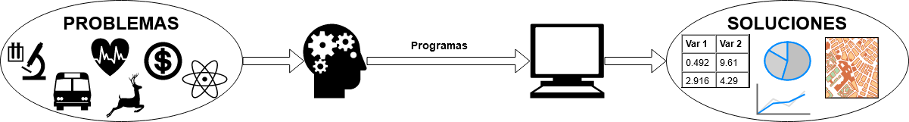
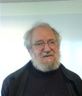
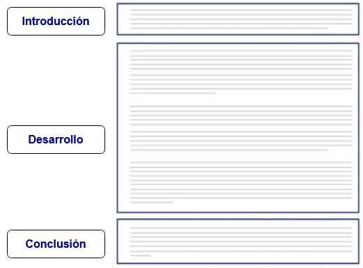
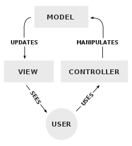

class: title-slide, right, top
background-image: url(img/turing-machine.png)
background-size: contain

.right-column[
# `r rmarkdown::metadata$title`

`r rmarkdown::metadata$author` 
`r rmarkdown::metadata$institute`
]

.palegrey[.left[.footnote[<small>Representación artística de una [máquina de Turing](https://es.wikipedia.org/wiki/M%C3%A1quina_de_Turing). Fuente: [Porao](https://commons.wikimedia.org/wiki/File:Turing_Machine.png).</small>]]]

---

# Contenidos

- ### ¿Qué es pensamiento computacional?
- ### Arquitectura de computadoras
- ### Lenguajes de programación
- ### Introducción al lenguaje Scratch

---

# Resolución de problemas mediante computadoras

--
    

---

# ¿Qué es pensamiento computacional?

--
- ### Es un enfoque para la resolución de problemas basado en conceptos y métodos de las ciencias de la computación.

--
- ### Las soluciones se expresan de forma tal que puedan ser implementadas en una computadora.

--
- ### Puede ser aplicado en muchas áreas, no solo en computación.

--
- ### Además de la programación, el pensamiento computacional incluye otras etapas como análisis, diseño y pruebas.

--
- ### Se considera una de las destrezas fundamentales del siglo XXI.

---

# ¿Qué implica resolver problemas mediante pensamiento computacional?

--
- ### Dividir un problema en subproblemas más pequeños (**descomposición**).

--
- ### Buscar similitudes en los problemas (**reconocimiento de patrones**).

--
- ### Identificar la información que se necesita y descartar la que no se necesita (**abstracción**).

--
- ### Describir la solución paso por paso (**algoritmos**).

---

# Investigación en pensamiento computacional

--
.pull-left[
**Seymour Papert**  
<small>
Matemático, pionero de la inteligencia artificial, co-creador del lenguaje de programación Logo.
</small>

<figure>
  
  <figcaption>
    <small>Fuente: [ak_mardini](https://commons.wikimedia.org/wiki/File:Papert.jpg).</small>
  </figcaption>
</figure>

<small>
- *Mindstorms: Children, Computers, and Powerful Ideas* (1983)  
- [*An Exploration in the Space of Mathematics Educations* (1996)](http://www.papert.org/articles/AnExplorationintheSpaceofMathematicsEducations.html)
</small>
]

--
.pull-right[
**Jeannette Wing**  
<small>
Investigadora en ciencias de la computación, ex vicepresidente de Microsoft Research.
</small>

<figure>
  
  <figcaption>
    <small>Fuente: [World Economic Forum](https://commons.wikimedia.org/wiki/File:Jeannette_Wing,_Davos_2013.jpg).</small>
  </figcaption>
</figure>

<small>
- [*Computational thinking* (2006)](https://www.cs.cmu.edu/~15110-s13/Wing06-ct.pdf)
</small>
]

---
class: center

# Conceptos fundamentales del pensamiento computacional

--
  
<figure>
  
  <figcaption>
    <small>Fuente: <a href="https://www.coursera.org/learn/computational-thinking-problem-solving">Universidad de Pennsylvania</a>.</small>
  </figcaption>
</figure>

---

# Descomposición

--
.pull-left[
- ### División de un problema complejo en subproblemas más fáciles de resolver.

- ### La unión de las soluciones a los subproblemas brinda la solución al problema original.
]

--
.pull-right[
<figure>
  
  <figcaption>
    <small>Fuente: <a href="https://www.coursera.org/learn/computational-thinking-problem-solving">Universidad de Pennsylvania</a>.</small>
  </figcaption>
</figure>
]

---

# Descomposición - ejemplo
## Escritura de un documento

--
.pull-left[
### Documento sin secciones
<figure>
  
  <figcaption>
    <small>Fuente: <a href="https://www.coursera.org/learn/computational-thinking-problem-solving">Universidad de Pennsylvania</a>.</small>
  </figcaption>
</figure>
]

--
.pull-right[
### Documento con secciones
<figure>
  
  <figcaption>
    <small>Fuente: <a href="https://www.coursera.org/learn/computational-thinking-problem-solving">Universidad de Pennsylvania</a>.</small>
  </figcaption>
</figure>
]

---

# Descomposición - ejemplo
## Mapas de teselas (*tile maps*)

--
Se componen de múltiples rectángulos (teselas o *tiles*) de diferentes tamaños que se agregan y desagregan conforme se requiere en acercamientos, alejamientos y otras operaciones.

--
  
<figure>
  
  <figcaption>
    <small>Fuente: <a href="https://commons.wikimedia.org/wiki/File:Tiled_web_map_Stevage.png">Stevage</a>.</small>
  </figcaption>
</figure>

---

# Reconocimiento de patrones

--
.pull-left[
- ### Se buscan similitudes o características compartidas entre problemas o componentes de un mismo problema.

- ### Facilita la resolución de un problema al aplicarse una respuesta ya desarrollada.
]

--
.pull-right[
<figure>
  
  <figcaption>
    <small>Fuente: <a href="https://www.coursera.org/learn/computational-thinking-problem-solving">Universidad de Pennsylvania</a>.</small>
  </figcaption>
</figure>
]

---

# Reconocimiento de patrones - ejemplo
## Patrones arquitectónicos

--
.pull-left[
- Son posibles soluciones para problemas de diseño arquitectónico. Christopher Alexander et al. recopilaron más de 200 en su libro [*A Pattern Language: Towns, Buildings, Construction* (1977)](https://laptrinhx.com/a-pattern-language-3372046788/).
- "*Cada patrón describe un problema que ocurre infinidad de veces en nuestro entorno, así como la solución al mismo, de tal modo que podemos utilizar esta solución un millón de veces más adelante sin tener que volver a pensarla otra vez.*" (Christopher Alexander)
]

--
.pull-right[
<figure>
  
  <figcaption>
    <small>Fuente: <a href="https://laptrinhx.com/a-pattern-language-3372046788/">A Pattern Language</a>.</small>
  </figcaption>
</figure>
]

---

# Reconocimiento de patrones - ejemplo
## Patrones de diseño de software

--
.pull-left[
- Inspirados en las ideas de Alexander, varios ingenieros de software desarrollaron patrones para resolver problemas comunes de desarrollo de software.
- Los patrones de diseño de software alcanzaron gran popularidad con la publicación del libro [*Design Patterns: Elements of Reusable Object-Oriented Software* (1994)](https://en.wikipedia.org/wiki/Design_Patterns), escrito por Erich Gamma, Richard Helm, Ralph Johnson y John Vlissides; y en el cual se documentan [23 patrones de diseño de software](https://en.wikipedia.org/wiki/Design_Patterns#Patterns_by_type).
]

--
.pull-right[
<figure>
  
  <figcaption>
    <small>Diagrama de interacciones en el patrón de diseño de software denominado <a href="https://es.wikipedia.org/wiki/Modelo%E2%80%93vista%E2%80%93controlador">Modelo-Vista-Controlador o <em>Model-View-Controller</em> (MVC)</a>. Fuente: <a href="https://commons.wikimedia.org/wiki/File:MVC-Process.svg">RegisFrey</a>.</small>
  </figcaption>
</figure>
]

---

# Abstracción

--
.pull-left[
- ### Identificación de cuáles aspectos de un problema son importantes y de cuáles no lo son.

- ### Ayuda a construir un modelo de la solución.
]

--
.pull-right[
<figure>
  
  <figcaption>
    <small>Fuente: <a href="https://www.coursera.org/learn/computational-thinking-problem-solving">Universidad de Pennsylvania</a>.</small>
  </figcaption>
</figure>
]

---

# Algoritmos

--
.pull-left[
- ### Indicaciones detalladas de como resolver, paso por paso, un problema.

- ### Especifican el orden en el que deben ejecutarse los pasos.
]

--
.pull-right[
<figure>
  
  <figcaption>
    <small>Fuente: <a href="https://www.coursera.org/learn/computational-thinking-problem-solving">Universidad de Pennsylvania</a>.</small>
  </figcaption>
</figure>
]
